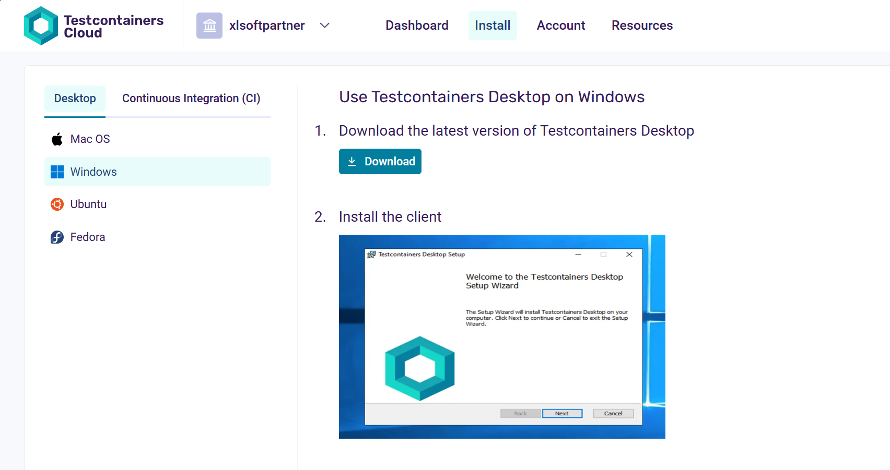
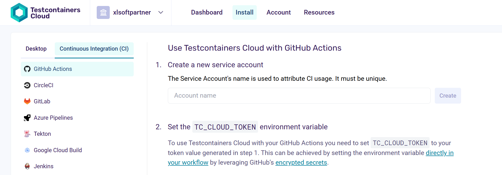
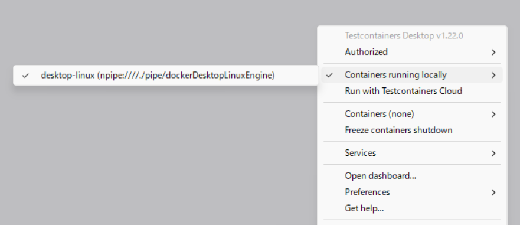
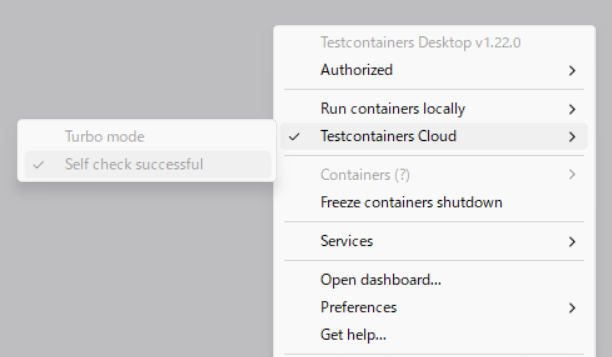

# docker-testcontainer-cloud-demo

Testcontainers Cloud のデモ環境です。

このドキュメントでは、Testcontainers をローカルで実行する方法と Testcontainers Cloud を GitHub Actions から利用する方法を紹介します。

## 環境設定

[Testcontainers Cloud のログインページ](https://app.testcontainers.cloud/login) から Docker アカウントでログインし、Profile を選択します。


### Testcontainners Desktop のインストール

Docker 有償プランをご利用の方、デスクトップからテストを Testcontainers Cloud で実行させたい方は Testcontainers Desktop が必要です。

ページ上部のメニューの「Install＞Desktop」からご利用の OS を選択し、指示にしたがい Desktop アプリをインストールします。



起動後、ログインしてください。


### Testcontainers のサービスアカウントを作成 (Cloud 用)

ページ上部のメニューの「Install＞Continuous Integration (CI)」からご利用の CI サービスを選択し、サービスアカウントを作成します。



Access Token が生成されるのでコピーして保存しておきます。


### GitHub のシークレットを設定 (Cloud 用)

GitHub のレポジトリで「Settings＞Secrets and variables＞Actions」で「Repository secrets」を作成し、`TC_CLOUD_TOKEN` の名前で先ほどの Access Token を登録します。


## テスト実行

テストコードに任意のモジュールを利用したコンテナーを用意し、接続などをテストします。

テストの流れは以下のようになります。

```java
// PostgreSQL コンテナの定義。イメージは "postgres:16-alpine" を使用。
static PostgreSQLContainer<?> postgres = new PostgreSQLContainer<>(
  "postgres:16-alpine"
);

// テストクラス全体の前に一度だけ実行されるセットアップメソッド。PostgreSQL コンテナを起動。
@BeforeAll
static void beforeAll() {
  postgres.start();
}

// テストクラス全体の後に一度だけ実行されるクリーンアップメソッド。PostgreSQL コンテナを停止。
@AfterAll
static void afterAll() {
  postgres.stop();
}

// 各テストケースの前に実行されるセットアップメソッド。DB への接続を初期化。
@BeforeEach
void setUp() {
  DBConnectionProvider connectionProvider = new DBConnectionProvider(
    postgres.getJdbcUrl(),
    postgres.getUsername(),
    postgres.getPassword()
  );
  customerService = new CustomerService(connectionProvider);
}

// 実際のテストケース
@Test
void shouldGetCustomers() {
  customerService.createCustomer(new Customer(1L, "George"));
  customerService.createCustomer(new Customer(2L, "John"));

  List<Customer> customers = customerService.getAllCustomers();
  assertEquals(2, customers.size());
}
```


### ローカルでのテスト

Testcontainers Desktop をインストールしている場合は、「Containers running locally」を選択してテストを実行します。




### Testcontainers Desktop 経由でクラウドでテスト

「Testcontainers Cloud」を選択してテストを実行します。




### GitHub Actions でテスト

GitHub Actions の yaml で以下のように  を呼び出し、テストを実行します。

```yaml
- name: Setup Testcontainers Cloud Client
uses: atomicjar/testcontainers-cloud-setup-action@main
with:
    token: ${{ secrets.TC_CLOUD_TOKEN }}
- name: Run example
run: mvn -B -V test
```

以下のように結果が得られるはずです。

```text
[INFO] Results:
[INFO] 
[INFO] Tests run: 2, Failures: 0, Errors: 0, Skipped: 0
[INFO] 
[INFO] ------------------------------------------------------------------------
[INFO] BUILD SUCCESS
[INFO] ------------------------------------------------------------------------
[INFO] Total time:  31.109 s
[INFO] Finished at: 2025-09-30T06:56:13Z
[INFO] ------------------------------------------------------------------------
```

## お疲れさまでした

Testcontainers を利用して依存サービスのテストが実行できることを学びました！
